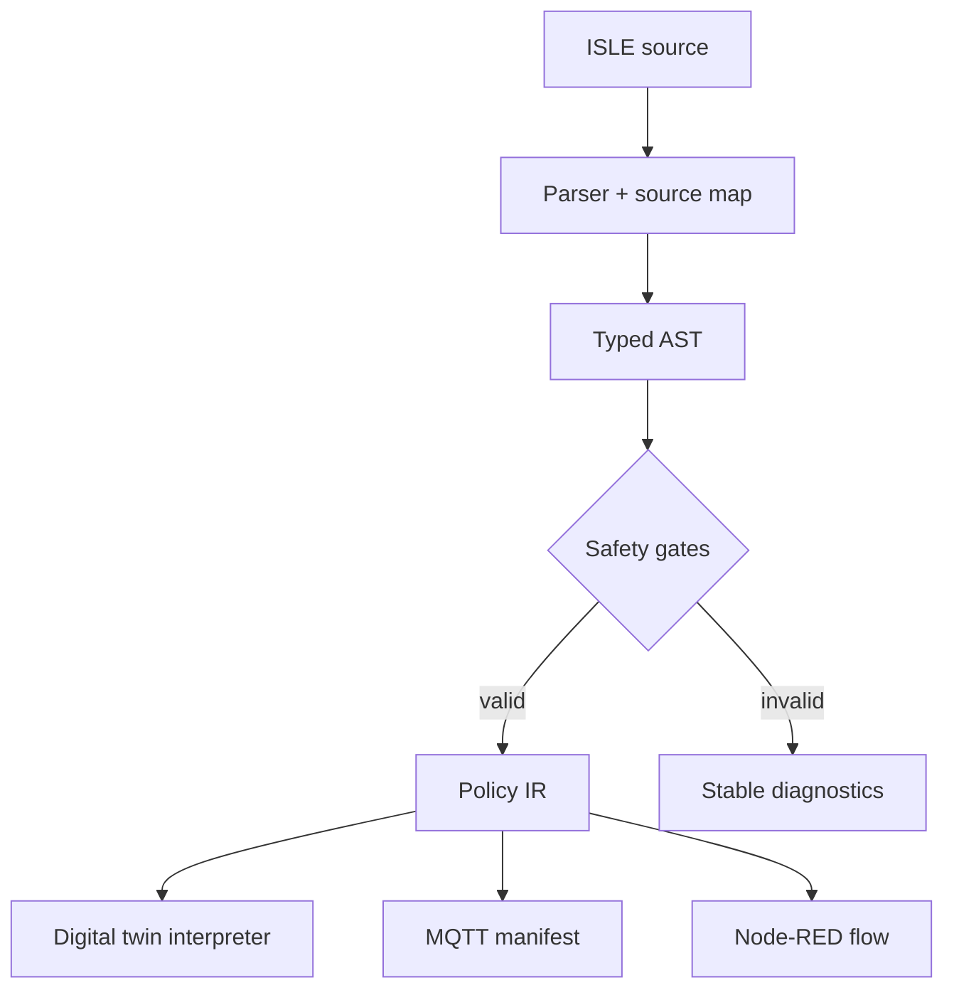
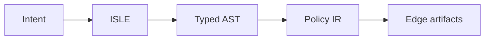

# ISLE

### Program energy resilience, not devices.

[](https://isle-language.oar-voguish-7e.chatgpt.site)
[](#testing)
[](./LICENSE)
[](https://syntax-summit.devpost.com/)


ISLE is a domain-specific language for microgrids that must keep critical infrastructure running during outages. It brings IoT telemetry, physical units, load priorities, failover rules, and deployment targets into one program that can be checked before it touches a real actuator.

The repository contains a real line-oriented parser, semantic validator, deterministic energy simulator, intermediate bytecode emitter, MQTT manifest compiler, Node-RED transpiler, interactive digital twin, and an optional streaming AI authoring route.

## 30-second demo

1. Open the [live playground](https://isle-language.oar-voguish-7e.chatgpt.site).
2. Press **Trigger blackout** in the Digital Twin panel.
3. Watch ISLE enter island mode, preserve the ICU and vaccine refrigerator, and shed flexible loads.
4. Compare the battery curve against a conventional controller in **Runtime**.
5. Remove `vaccine_fridge` from `preserve [...]` and press **Compile & run**. The compiler blocks the unsafe policy.
6. Inspect generated MQTT and Node-RED outputs.

## Why ISLE

Physical automation is usually split across vendor dashboards, MQTT glue, scripts, spreadsheets, and operational knowledge. That creates three failure modes:

- physical units are strings rather than types;
- emergency behavior is discovered during the emergency;
- the simulation, documentation, and deployed automation drift apart.

ISLE makes the safety case executable. A policy cannot emit deployment artifacts until its units, critical-load preservation, storage reserve, telemetry invariant, source/storage references, and failover structure are coherent.

```isle
microgrid rural_clinic {
  source solar peak 18kW topic "clinic/solar/kw"
  storage battery capacity 48kWh reserve 25%

  telemetry vaccine_temp topic "clinic/vaccine/temp" unit c

  load icu 4.8kW priority critical
  load vaccine_fridge 1.2kW priority critical
  load hvac 3.6kW priority flexible
  load water_pump 1.8kW priority deferrable

  policy monsoon_outage {
    when grid offline for 1m
    preserve [icu, vaccine_fridge]
    shed flexible if runtime < 10h
    charge battery when solar > demand
    ensure vaccine_temp between 2c and 8c
  }
}

simulate monsoon_12h
compile mqtt node_red
```

## What it does

| Capability | Implementation |
|---|---|
| Parse ISLE source | Deterministic line-oriented parser with source locations and stable diagnostic codes |
| Check physical semantics | Unit checks for `kW`, `kWh`, `%`, time, and temperature; symbol/reference validation |
| Enforce failover completeness | Every critical load must appear in `preserve`; policy, storage, telemetry, and scenario are required |
| Interpret a policy | Ten-minute energy-balance simulation with solar production, outage state, battery efficiency, load priority, reserve floor, and cold-chain temperature |
| Compare strategies | Runs the ISLE policy and a conventional all-load controller against the same deterministic scenario |
| Compile for the edge | Emits ISLE bytecode, MQTT subscription/publication manifest, and importable Node-RED JSON |
| Author with AI (optional) | Streams source-only completions through an authenticated server route; never participates in runtime decisions |

## Architecture



The execution path is deterministic. The optional authoring copilot is isolated upstream of the parser: its output must pass the same compiler and safety gates as handwritten code.

## Simulation model

The included digital twin is intentionally small enough to audit and deterministic enough to reproduce. It advances in ten-minute steps and models:

- daylight solar generation with a scenario-specific storm attenuation curve;
- grid-connected and islanded energy balance;
- battery capacity, round-trip loss, and policy reserve floor;
- critical, flexible, and deferrable load allocation;
- cold-chain temperature response when refrigeration is or is not powered;
- identical exogenous conditions for ISLE and baseline comparisons.

It is a language/runtime prototype, not a certified protection controller or electrical design tool.

## Compiler pipeline



1. The parser recognizes the language's line-oriented grammar and attaches line numbers.
2. The semantic pass resolves sources, storage, telemetry, loads, policy references, and compile targets.
3. The safety pass checks physical dimensions and failover completeness.
4. The lowering pass produces compact policy bytecode.
5. Target emitters generate MQTT and Node-RED artifacts.
6. The interpreter consumes the same AST to run the digital twin.

See [the complete grammar](./docs/GRAMMAR.md) and [architecture notes](./docs/ARCHITECTURE.md).

## Tech stack

- Next.js App Router, React 19, TypeScript
- Tailwind CSS 4 for utilities and design tokens
- Radix UI Tabs and Tooltip primitives
- Framer Motion micro-interactions
- Lucide icons
- Vinext/Cloudflare Worker production build for the hosted demo
- Standard Next.js build path for Vercel
- Official OpenAI JavaScript SDK and Responses streaming for the optional authoring copilot
- Node test runner + `tsx` for compiler/interpreter tests

## Project structure

```text
app/
├── api/compose/route.ts       # Optional streaming authoring copilot
├── globals.css                # Product design system and responsive UI
├── layout.tsx                 # Metadata and social preview
└── page.tsx                   # Product narrative and studio shell
components/
└── isle-studio.tsx            # Editor, digital twin, charts, compiler outputs
lib/
├── isle.ts                    # Parser, validator, emitters, interpreter
└── samples.ts                 # Three executable microgrid programs
tests/
├── isle.test.ts               # Language safety and simulation tests
└── rendered-html.test.mjs     # Production metadata/render smoke test
docs/
├── ARCHITECTURE.md
├── DEVPOST_SUBMISSION.md
├── GRAMMAR.md
└── VIDEO_DEMO.md
```

## Quickstart

### Prerequisites

- Node.js 22.13 or newer
- npm 10 or newer

```bash
git clone https://github.com/your-username/isle-language.git
cd isle-language
npm install
cp .env.example .env.local
npm run dev:next
```

Open `http://localhost:3000` for the standard Next.js dev server. The repository also retains its configured Vinext runtime for the hosted Worker build.

The compiler, simulator, digital twin, and deployment emitters work with no API key.

### Optional authoring copilot

```env
OPENAI_API_KEY=your_key_here
OPENAI_MODEL=gpt-5.5
```

`POST /api/compose` accepts `{ "prompt": "..." }` and streams plain ISLE source. The key stays server-side. The route validates input length, disables caching, handles provider errors safely, and is abort-aware. The implementation follows the official [OpenAI Responses streaming guidance](https://developers.openai.com/api/docs/guides/streaming-responses).

## Commands

```bash
npm run dev:next      # Standard Next.js local development
npm run dev           # Vinext/Vite local runtime
npm run test:unit     # Parser, safety, emitter, and simulator tests
npm test              # Full unit + production build + rendered HTML gate
npm run build         # Hosted Worker artifact
npm run build:vercel  # Standard Next.js/Vercel build
```

## Testing

The test suite verifies that:

- all reference programs compile without errors;
- MQTT and Node-RED targets are emitted;
- an omitted critical load blocks compilation;
- `kW` cannot be used where `kWh` is required;
- the ISLE policy extends critical-load autonomy under the same simulated outage;
- social and product metadata render in the production worker.

Run everything with:

```bash
npm test
```

## Deployment

### Vercel

1. Import the repository into Vercel.
2. Keep the detected framework as **Next.js**.
3. `vercel.json` invokes `npm run build:vercel`.
4. Add `OPENAI_API_KEY` and `OPENAI_MODEL` only if you want the optional copilot.
5. Deploy. No database or persistent storage is required.

### Hosted demo

The current production build is available at [isle-language.oar-voguish-7e.chatgpt.site](https://isle-language.oar-voguish-7e.chatgpt.site).

## Hackathon rubric fit

| Syntax Summit criterion | ISLE evidence |
|---|---|
| Innovation & Originality | A language-level safety case for physical automation, not another device dashboard |
| Technical Implementation | Parser, typed AST, semantic diagnostics, interpreter, deterministic physics model, bytecode, and two target emitters |
| Language Design | Compact domain vocabulary: `source`, `storage`, `telemetry`, `priority`, `preserve`, `shed`, `ensure` |
| Documentation & Presentation | Executable samples, grammar, architecture, one-command tests, live playground, and demo script |
| Real-World Impact | Applicable to clinics, schools, food hubs, shelters, and other islandable microgrids |
| User Experience | Edit, compile, simulate, trigger failure, compare outcomes, and inspect outputs in one responsive workspace |

## Roadmap

- WebAssembly edge interpreter for gateway-class hardware
- Home Assistant and IEC 61850 target emitters
- Probabilistic solar/load scenarios and Monte Carlo policy testing
- Signed policy bundles and hardware-in-the-loop replay
- Visual topology import from one-line electrical diagrams

## Submission kit

- [Devpost-ready copy](./docs/DEVPOST_SUBMISSION.md)
- [2:45 demo script and anti-jitter recording workflow](./docs/VIDEO_DEMO.md)
- [Architecture and data flow](./docs/ARCHITECTURE.md)
- [Language grammar](./docs/GRAMMAR.md)

## License

MIT — see [LICENSE](./LICENSE).
